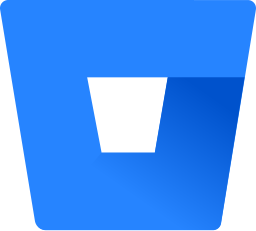

**About me**

My name is Nolan Cyr and I'm from New York City. Currently, I am pursuing a Bachelor of Science degree in Computer Science at The University of Vermont. What I enjoy most about programming is that it allows us to take a difficult or complicated problem and simplify it into a logical and elegant solution. Additionally, I have a strong interest in mathematics and love discovering the connections between math and computer science, and how they complement one another in problem solving.

**Language Experience**

  
  
  
  
  
  
  
  

 

**Tool Experience**

  
  
  
  

 

**Coursework**
- [Web Design Final Project](https://github.com/NolanSmug/cs008-web-design-final)
- [Programming I Final Project – Wordle & Pangram](https://github.com/NolanSmug/wordle-and-pangram)
- [Intermediate Programming Final Project – Yahtzee](https://github.com/NolanSmug/yahtzee)

**Personal Projects**
- [Blackjack](https://github.com/NolanSmug/blackjack)
- [Kaprekar's Routine](https://github.com/NolanSmug/kaprekars-routine)

<!--
**NolanSmug/NolanSmug** is a ✨ _special_ ✨ repository because its `README.md` (this file) appears on your GitHub profile.

Here are some ideas to get you started:

- 🔭 I’m currently working on ...
- 🌱 I’m currently learning ...
- 👯 I’m looking to collaborate on ...
- 🤔 I’m looking for help with ...
- 💬 Ask me about ...
- 📫 How to reach me: ...
- 😄 Pronouns: ...
- ⚡ Fun fact: ...
-->
